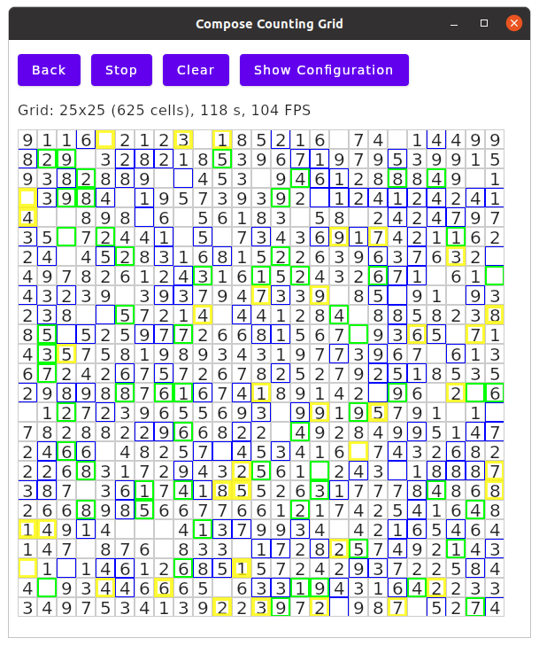

### Compose Counting Grid

A simple application to check **Compose for Desktop** and **Compose for Web (Canvas)** drawing speeds when drawing grids (or tables) with larger numbers of cells.

Implementation differences:
* The desktop application uses a window-sized canvas. Compose scrollbars appear if necessary.
* The web application uses a content-sized (window) canvas. The browser's scrollbars appear if necessary.

#### Initial Scene

#### Desktop with Recomposition Highlighting

#### Desktop High-Frequency Update (Top Row Only)

* This animated GIF ⚠️ **not suitable for people with photosensitive epilepsy** ⚠️ demonstrates increasing FPS as the window shrinks: [Animation with high-frequency updates](docs/top-row-only-updates-resizing.gif).

    > This effect appears with the desktop application, not the web application.

#### How It Operates

Given a grid of cells: Choose a random cell. Increase its single-digit count. Repeat.

Unless pausing is enabled, updates will be drawn as fast as possible. The desktop application will even go beyond your display's vsync frequency (which Compose/Skia normally would not do, as it makes no sense other than to check the speed).

#### How To Build And Run

JVM desktop application: `./gradlew run`

Browser application: `./gradlew frontendWebBrowserProductionRun` (requires some patience for bundles to load)

> Currently, `frontendWebBrowserDevelopmentRun` cannot be used as the development bundle does not build due to [JetBrains/compose-jb#2255](https://github.com/JetBrains/compose-jb/issues/2255).

#### What To Try

* Try everything without animations first.
* Resize the window so that only the top row of counters is visible.
* Highlight re-compositions.
* Toggle "Force top-level recomposition".

#### Remarks

* This application does not simulate any real-world scenario as it uses a very simple layout with fixed-size cells.
* Compose for Web on Canvas is at an experimental stage. This application uses funky tricks to fit the canvas to its content size.

#### Findings

Observations:
* Larger grids are slower.
* Grids with fewer cells containing text are faster (choose top-row updates only, then clear the grid).
* Grids with more cells scrolled out of view (applies to desktop only) are faster.
* Top- or row-level layout and recomposition accounts for about 10% of total performance (try forcing top-level and/or row-level recompositions, check the profiler's flame graph). In these scenarios, redrawing dominates performance.
* Cell-level recomposition is expensive. On desktop, it cuts the frame rate by 70% (25x25 grid).
* Directly switching between grid variants with and without `AnimatedContent` animations (one per cell) can be very expensive due to excessive slot table manipulations. This application provides several options to work around this. See [separate information for details](docs/SwitchingAnimationVariants.md).

Conclusions:
* Currently, it appears that the entire (window) canvas is redrawn on every frame. Once [JetBrains/skiko#53](https://github.com/JetBrains/skiko/issues/53) is fixed and only updated parts are redrawn, expect significant performance increases.
* Drawing time increases with the number of visible layout nodes.
* Still, Compose for Desktop seems pretty fast.
* Compose for Web/Canvas is significantly slower than desktop (I have seen roughly a factor of 3), but it would also use just 10% for layout and top/row-level recomposition. Depending on the use case, even at this early stage Web/Canvas could still be fast enough.
* It pays to avoid recompositions which affect large numbers of composables.

#### Changes

##### 2022-08-23
 
* Added options to force row-level and cell-level recompositions. Revised conclusions regarding recomposition and layout impact.
* Improved UI responsiveness when toggling options for recomposition highlighting and animations.

##### 2022-09-02
 
* Redesigned Web/Canvas integration thanks to @langara

##### 2022-09-12

* Added instrumentation to analyze UI responsiveness when switching animations:
    * Added console logging with timestamps.
    * Added configuration settings:
        * Draw cell text
        * Track drawing
        * Hide grid temporarily when switching animations
* Updated observations in README.
* Added animation switching analysis in `docs/SwitchingAnimationVariants.md`.
* Refactored GridScene to avoid unnecessary grid recompositions when controls update. 

##### 2022-09-16

* Added options to speed up animation switching:
    * Enable grid generations
    * Enable BoxWithConstraints per row
* Updated timing results

##### 2023-03-03

* Migrated to Kotlin 1.8.20-Beta, Compose 1.4.0-alpha01-dev958
* Web: Re-introduce BrowserViewportWindow, resizing canvas via window event listener (less coupling with Compose Web internals) 
