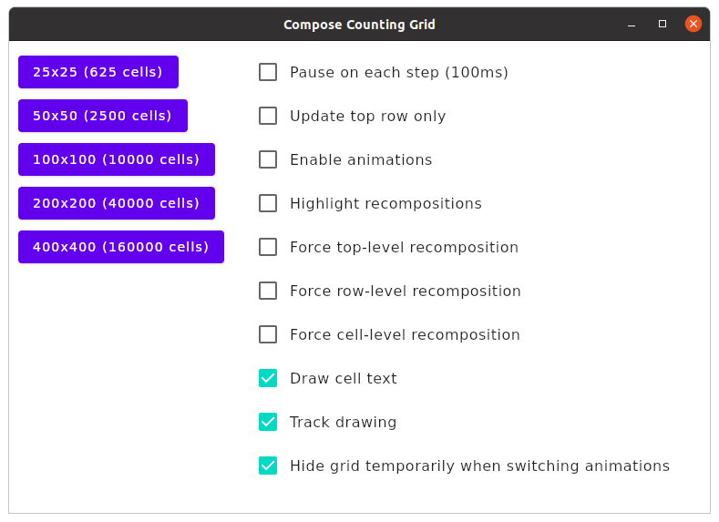
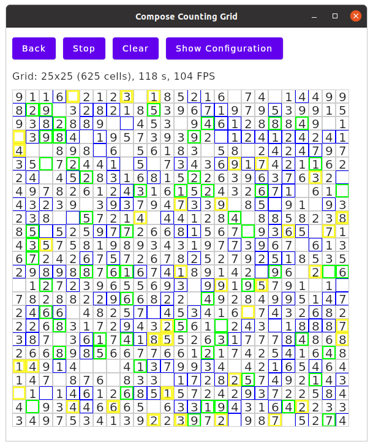

### Compose Counting Grid

A simple application to check **Compose for Desktop** and **Compose for Web (Canvas)** drawing speeds when drawing grids (or tables) with larger numbers of cells.

Implementation differences:
* The desktop application uses a window-sized canvas. Compose scrollbars appear if necessary.
* The web application uses a content-sized (window) canvas. The browser's scrollbars appear if necessary.

#### Initial Scene

#### Desktop with Recomposition Highlighting

#### Desktop High-Frequency Update (Top Row Only)

* This animated GIF ⚠️ **not suitable for people with photosensitive epilepsy** ⚠️ demonstrates increasing FPS as the window shrinks: [Animation with high-frequency updates](docs/top-row-only-updates-resizing.gif).

    > This effect appears with the desktop application, not the web application.

#### How It Operates

Given a grid of cells: Choose a random cell. Increase its single-digit count. Repeat.

Unless pausing is enabled, updates will be drawn as fast as possible. The desktop application will even go beyond your display's vsync frequency (which Compose/Skia normally would not do, as it makes no sense other than to check the speed).

#### How To Build And Run

JVM desktop application: `./gradlew run`

Browser application: `./gradlew frontendJsBrowserProductionRun` (requires some patience for bundles to load)

> Currently, `frontendJsBrowserDevelopmentRun` cannot be used as the development bundle does not build.

#### What To Try

* Try everything without animations first.
* Resize the window so that only the top row of counters is visible.
* Highlight re-compositions.
* Toggle "Force top-level recomposition".

#### Remarks

* This application does not simulate any real-world scenario as it uses a very simple layout with fixed-size cells.
* Compose for Web on Canvas is at an experimental stage. This application uses funky tricks to fit the canvas to its content size.

#### Findings

Observations:
* Larger grids are slower.
* Grids with fewer cells containing text are faster (choose top-row updates only, then clear the grid).
  > Note that empty cells don't have a `Text` component.
* Grids with more cells scrolled out of view (applies to desktop only) are faster.
* Layout and recomposition accounts for about 10% of total performance (try forcing top-level recompositions, check the profiler's flame graph), so redrawing dominates performance. 

Conclusions:
* Currently, it appears that the entire (window) canvas is redrawn on every frame. Once [JetBrains/skiko#53](https://github.com/JetBrains/skiko/issues/53) is fixed and only updated parts are redrawn, expect significant performance increases.
* Drawing time increases with the number of visible layout nodes.
* Still, Compose for Desktop seems pretty fast.
* Compose for Web/Canvas is significantly slower than desktop (I have seen roughly a factor of 3), but it would also use just 10% for layout and recomposition. Depending on the use case, even at this early stage Web/Canvas could still be fast enough.
