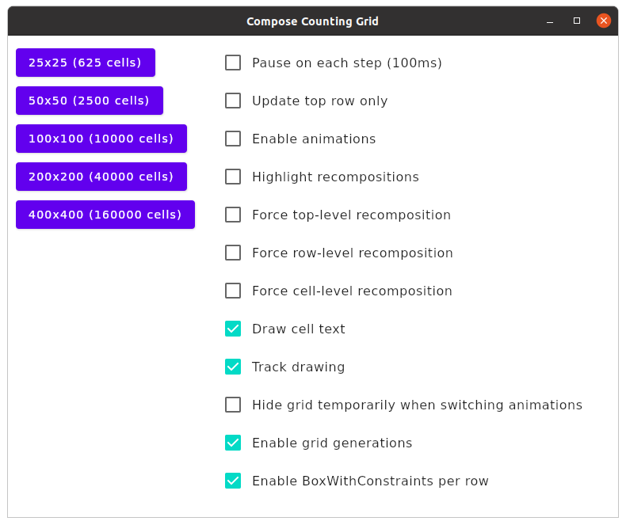

### Compose Counting Grid

A simple application to check **Compose for Desktop** and **Compose for Web (Canvas)** drawing speeds when drawing grids (or tables) with larger numbers of cells.

Implementation differences:
* The desktop application uses a window-sized canvas. Compose scrollbars appear if necessary.
* The web application uses a content-sized (window) canvas. The browser's scrollbars appear if necessary.

#### Initial Scene

#### Desktop with Recomposition Highlighting

#### Desktop High-Frequency Update (Top Row Only)

* This animated GIF ⚠️ **not suitable for people with photosensitive epilepsy** ⚠️ demonstrates increasing FPS as the window shrinks: [Animation with high-frequency updates](docs/top-row-only-updates-resizing.gif).

    > This effect appears with the desktop application, not the web application.

#### How It Operates

Given a grid of cells: Choose a random cell. Increase its single-digit count. Repeat.

Unless pausing is enabled, updates will be drawn as fast as possible. The desktop application will even go beyond your display's vsync frequency (which Compose/Skia normally would not do, as it makes no sense other than to check the speed).

#### How To Build And Run

JVM desktop application: `./gradlew clean runRelease`

Js browser application: `./gradlew clean -Dapplication.useJs=true frontendJsBrowserProductionRun` (requires some patience for bundles to load)

Wasm browser application: `./gradlew clean frontendWasmBrowserProductionRun` (requires some patience for bundles to load)

#### What To Try

* Try everything without animations first.
* Resize the window so that only the top row of counters is visible.
* Highlight re-compositions.
* Toggle "Force top-level recomposition".
* Browser: Compare Js and Wasm speed and download file size differences (Skiko size will not change).

#### Remarks

* This application does not simulate any real-world scenario as it uses a very simple layout with fixed-size cells.
* Compose for Web on Js/Canvas is at an experimental stage, and now deprecated, favoring the upcoming WebAssembly target. This application uses funky tricks to fit the canvas to its content size.
* WebAssembly is also experimental. It currently requires carefully selected libraries, a specific Compose plugin and some hack to bridge an implementation gap regarding Node module imports.

#### Changes

##### 2023-07-12

* Web/Js: `BrowserViewportWindow` no longer crashes when resizing the window on Kotlin 1.9.0.
* Web/Wasm: Enabled optimization with binaryen, shrinking the (compressed) transfer size of `frontendWasm.wasm` from 1.2 MB to 612 kB, both in addition to Skiko's transfer size of 3.2 MB. Total transfer size with optimized Wasm is now 4.0 MB (with Web/Js at 3.8 MB). 
* Web/Wasm: Fixed node module import hack.

##### 2023-07-11

* Migrated to Kotlin 1.9.0
* Web/Wasm: Added a full WebAssembly target with Wasm-compiled frontend code (in addition to Skiko/Skia, which were always Wasm-compilations).
* Web/Js: With Kotlin 1.9.0, BrowserViewportWindow no longer reacts to resizing as the Kotlin/Js target now refuses access to non-public symbols.
* Removed non-current documentation.

##### 2022-09-16

* Added options to speed up animation switching:
    * Enable grid generations
    * Enable BoxWithConstraints per row
* Updated timing results

##### 2022-09-12

* Added instrumentation to analyze UI responsiveness when switching animations:
    * Added console logging with timestamps.
    * Added configuration settings:
        * Draw cell text
        * Track drawing
        * Hide grid temporarily when switching animations
* Updated observations in README.
* Added animation switching analysis in `docs/SwitchingAnimationVariants.md`.
* Refactored GridScene to avoid unnecessary grid recompositions when controls update.

##### 2022-09-02

* Redesigned Web/Canvas integration thanks to @langara

##### 2022-08-23
 
* Added options to force row-level and cell-level recompositions. Revised conclusions regarding recomposition and layout impact.
* Improved UI responsiveness when toggling options for recomposition highlighting and animations.
